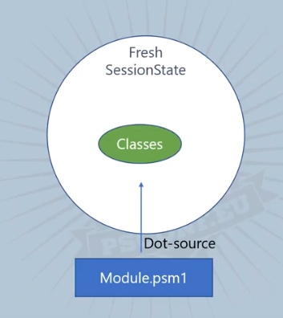
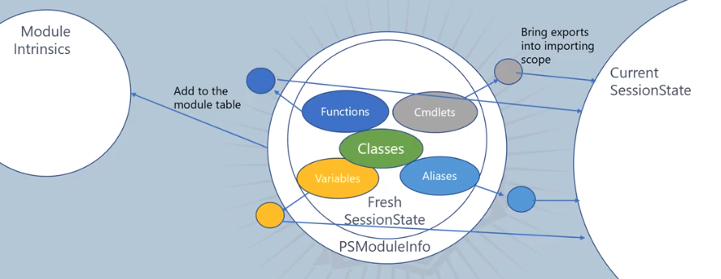
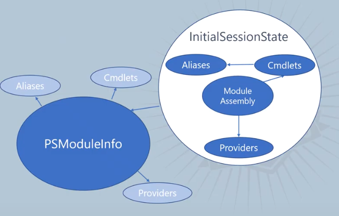
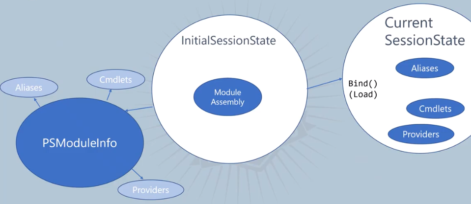
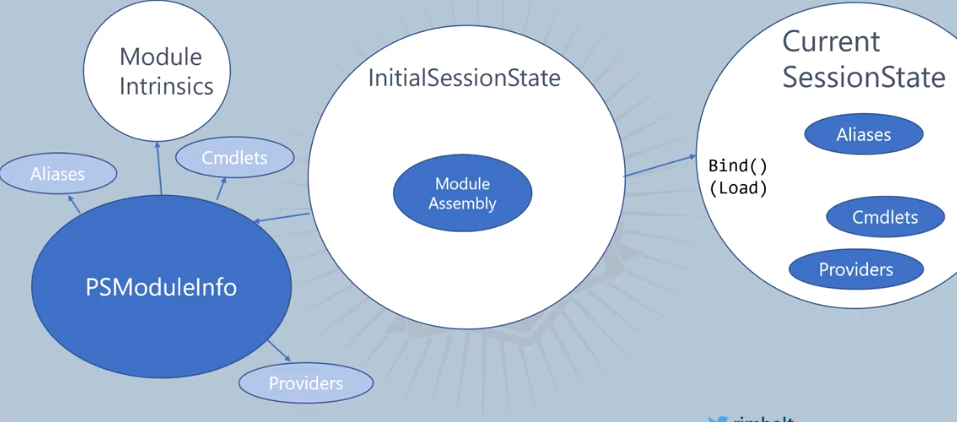

###### programming
# Powershell

**Powershell** is a powerful scripting language that can be used in any operating system.


<br>

## Why 


<br>

## Policies 

### Introduction 
As you can do any you want on a system using powershell, it is important to make sure your computer is protected from local or remote script execution. To prevent that to happen, you can define policies to restrict execution for your scripts.
There are : 

* Restricted : No script is allow to run 
* AllSigned : The script needs to be digitaly signed to run
* RemoteSigned : The remote script requires a trusted digital signature to run. But local scripts can run without any requirements.
* Unrestricted : It warns users when running remote scripts but won't block them 
* ByPpss: No restriction;
* Undefined

### Execution Scope

* LocalMachine 
* CurrentUser
* Process


<br>

## Types and Data Structures

### Object

Get object's properties and inspect them

```powershell
PS> $d = @{
  >> Name = "data"
>> Version = 1
>> }

PS /Users/lktslionel/Code/learns/programming/powershell> Select-Object  -InputObject $d -Property *

# Version Name
# ------- ----
#       1 data
```

To get properties and methods use : 

```powershell
PS> Get-Member -InputObject $d 
PS> Get-Member -InputObject $d -Type Method # For methods only
PS> Get-Member -InputObject $d -Type *Expr* # To filter
```

#### PSCustomObject 

Use this type to create your own object type

```powershell
$myType = [PSCustomObject]@{}
```

### Arrays / ArrayList 

Use `Arrays` for small set of elements
`Arrays` has a fixed size and every operation such as insert or remove, create a new Array.

```powershell
PS> $tables = @( "test" ) 
$tables += @("deux") 
```

Use `ArrayList` for large number of elements

```powershell
PS> $d = New-Object -TypeName System.Collections.ArrayList
PS> $d = [System.Collections.ArrayList]@()
PS> $d.Add(1)
PS> $d.Add("str")
$tables += @("deux") 
```


### Hastable

`HashTable` Are like dictionaries where data can be store as key/value pairs

```powershell
$d = @{
  Name = "test"
  Version = 1.2
}

$d = @{ Color = ‘Red’; Transmission = ‘Automatic’; Convertible = $false}
```

Common operations 

```powershell
$d.Name
$d["Version"]

# Missing one
$m = $d.MissingProp
$m -Eq $Null 

# Set values
$d.Add("key", 1)
$d["key"] = 1
$d.ContainsKey("lol") # => False

```


<br>

## Basics 

To list execution policies with their scope, use the following command: 

```powershell
$ Get-ExecutionPolicy -List

#         Scope ExecutionPolicy
#         ----- ---------------
# MachinePolicy    Unrestricted
#    UserPolicy    Unrestricted
#       Process    Unrestricted
#   CurrentUser    Unrestricted
#  LocalMachine    Unrestricted
```

### Powershell providers 

Built-in providers are : 

```powershell
PS> Get-PSProvider

# Name                 Capabilities                               Drives
# ----                 ------------                               ------
# Alias                ShouldProcess                              {Alias}
# Environment          ShouldProcess                              {Env}
# FileSystem           Filter, ShouldProcess, Credentials         {/}
# Function             ShouldProcess                              {Function}
# Variable             ShouldProcess                              {Variable}


# Or

PS> Get-PSDrive

# Name     Provider                              Root
# ----     --------                              ----
# /        Microsoft.PowerShell.Core\FileSystem  /
# Alias    Microsoft.PowerShell.Core\Alias
# Env      Microsoft.PowerShell.Core\Environment
# Function Microsoft.PowerShell.Core\Function
# Variable Microsoft.PowerShell.Core\Variable
```

You can also create your own provider : 

```powershell
PS> New-PSDrive -PSProvider Environment -Name AppEnv
PS> Set-Location AppEnv:
```


### Equivalence with bash 

To write a command on multiple line use <code>\`</code> : 

```powershell
Write-Host -param1 `
  -param1 <VAL> `
  -param2
```

It is also use to escape a special character like <code>\`$var</code>

### Scripts Block 

```powershell
$block = {

} 
```

it can contains instruction to be executed.
use `&` to execute the block.

```powershell
$block = { Clear-Host; "Out test"}
& $block # call the block 
```

### Pipes

`Out-File` Create a new file with the previous command output when you use a pipe (`|`)

```powershell
Get-Date | Out-File lol.txt
```

### Tests and Conditions

```powershell
If ( -Not (Test_path -Path ) ) 
{
  ...
}
```

<br>

## Pipelines

Powershell is a object-oriented solution that run on an object based environement.
A pipeline is somethimes used by adding a `|` between to tags.


For instance, the following command gets the name of the running processes

```powershell
$ pwsh> Get-Process | Select-Object -Property ProcessName
```


<br>

## Variables 

Variables start with `$` and store the contents in memory.

```powershell
$chromeProcesses = Get-Process -Name *Chrome*
```

<br>

## Loops


#### Do-While

```powershell
Do {
  $count = $count + 1 
  Write-Host "Count = $count"
} While ($count > 10 )
```

#### ForEach

```powershell
$colors = "blue", "red" ,"green", "yellow"

foreach ($color in $colors) {
  Write-Host "Color: $color"
}s
```


<br>

## Files

### Read 

```powershell
Cat <FilePath>
```

### Write

Example : 

```powershell
GetProcess | Out-File -FilePath <path/to/file>
```


<br>

## Functions


### Adding HELP / USAGE

`Get-Help` displays comment-based help

> See [About Comment Based Help
](https://docs.microsoft.com/en-us/powershell/module/microsoft.powershell.core/about/about_comment_based_help?view=powershell-7) for all available help options

#### Example

```powershell
function Get-ProcessNames()
{
<#
.SYNOPSIS

<SHORT DESC>

.DESCRIPTION

<DESC>

.PARAMETER Param1
<PARAM SHORT DESC>

.PARAMETER Param2
<PARAM SHORT DESC>

.INPUTS

<PIPE INPUT SHORT DESC>

.OUTPUTS

<PIPE OUTPUT SHORT DESC>

.EXAMPLE

PS> Get-ProcessNames ...

.EXAMPLE

PS> Get-ProcessNames ....

.LINK
#>

}
```

It will produce :

```powershell
PS> Get-Help Get-ProcessNames

NAME
  Get-ProcessNames

SYNOPSIS
  <SHORT DESC>


SYNTAX
  Get-ProcessNames [<CommonParameters>]


DESCRIPTION
  <DESC>


RELATED LINKS

REMARKS
  To see the examples, type: "get-help Get-ProcessNames -examples".
  For more information, type: "get-help Get-ProcessNames -detailed".
  For technical information, type: "get-help Get-ProcessNames -full".
```

To see **Examples** :: 

```powershell
get-help Get-ProcessNames -examples

NAME
    Get-ProcessNames

SYNOPSIS
    <SHORT DESC>


    -------------------------- EXAMPLE 1 --------------------------

    PS>Get-ProcessNames ...


    -------------------------- EXAMPLE 2 --------------------------

    PS>Get-ProcessNames ....
```    


### Heredoc 

```powershell

$doc = @'
...
'@
```


<br>

## Profiles

In power shell, we can use profile to auto load our helper functions.
The default profile file is located in the `$profile` variable.


<br>

## Modules & Snap-ins

### Module

A **Module** is a unit that brings additional functionnalities to your powershell scripts.
It is consist of : 

* Code
* A mnifest file
* Anything else need by youe code : assembly
* A Directory contains everything listed above and located wher pwsh can find it


Use the following command command to import a module

```powershell
Install-Package -Name <pkg>     [-Source]
Install-Module  -Name <module>  [-Source]
```

> Use `Find-Module -Name <MATCH>` to look for a module.

### Module Struture 

```
+------------------------------------------------+
|  Module/                                       |
|                          +-----------------+   |
|  +-------------------+   |  Module.psm1    |   |
|  | Submodule2/       |   +-----------------+   |
|  |  +---+  +---+     |                         |
|  |  |---|  |---|     |   +-----------------+   |
|  |  |---|  |---|     |   |  Module.psd1    |   |
|  |  +---+  +---+     |   +-----------------+   |
|  |                   |                         |
|  +-------------------+   +-----------------+   |
|                          |  Module.dll     |   |
|  +-------------------+   +-----------------+   |
|  | Submodule1.psm1   |                         |
|  +-------------------+   +-----------------+   |
|                          |  Types.ps1xml   |   |
|                          +-----------------+   |
|                          |  OnImport.ps1   |   |
|                          +-----------------+   |
+------------------------------------------------+
```

A module folder is compose of : 

* `Module.psm1` : The module file
* `Module.dll`  : Module assembly
* `Module.psd1` : Describes the contents of a module and determines how a module is processed.
* Submodules in their own folders. Eg `Submodule2`
* Submodules as `psm1` files. Eg `Submodule1.psm1`
* `Types.ps1xml` : An XML file that defines extended type data. Used with `Update-TypeData`
* `OnImport.ps1` : Hook script that runs when a moduule is imported 


### Module Discovery

#### 1. Load module from path

It can be done by path : 

```powershell
Import-Module <PATH/OF/PSM1/FILE>
```

#### 2. Load module from Env

> `$env:PATH` is not used because in can load things not related to powersehll and breaks the system

Instead powershell uses `$env:PSModulePath`. Eg: C:\dir1;C:\dir2

> Paths are separated with `;` on **Windows** and `:` on **\*nix**, **macos** systems.
> ```powershell
> # on windows
> $Env:PSModulePath + ";<path>"
> 
> # on *unix/macos
> $Env:PSModulePath + ";C:\ps-test\Modules"
> ```
> 

#### 3. Load module from sytem special directory path

* [XDG](https://specifications.freedesktop.org/basedir-spec/basedir-spec-latest.html) directories
  * `$XDG_DATA_HOME`
  * `$XDG_CONFIG_HOME`
  * `$XDG_DATA_DIRS`
  * `$XDG_CONFIG_DIRS`
  * `$XDG_CACHE_HOME`
  * `$XDG_RUNTIME_DIR`


* System wide
  * `$PSHOME\Modules`

* Unix/Macos
  * `$HOME/.local/share/powershell/Modules`

* Windows
  > You can verify the location of your Documents folder using the following command: `[Environment]::GetFolderPath('MyDocuments')`.
  * `$HOME\Documents\PowerShell\Modules`
  * In Product Directory (within program files): `C:\Program Files\<ORG>\<PRODUCT>\Modules\`
  * For all users in program files : `$Env:ProgramFiles\WindowsPowerShell\Modules\<Module Folder>\<Module Files>`
  * in the Common Files Directory: `$env:ProgramFiles + '\Common Files\Modules'`
  * for multiple versions: `C:\Program Files\<PROGRAM>\<PROGRAM><VERSION>\`

> Make sure those files are present in `$env:PSModulePath`.


### Module Searching

> Note: Powershell module are **case-insensitive**.

1. When you type `Import-Module <MODULE_NAME>`, powershell try to look for your module inside `$env:PSModulePath` directories, one after another:
`Dir1/<MODULE_NAME>:Dir2/<MODULE_NAME>:...:DirN<MODULE_NAME>` 

2. When it found the module directory, it then looks for the version inside `/Dir/<MODULE_NAME>/X.Y.Z`; it will always take the higher version.
3. If no version directory exists, it thry tho find module files:
   1. `.psd1` module manifest file
   2. `.psm1` script module file
   3. `.cdxml` cdxml module file
   4. `.ni.dll` Engine DLL binary module
   5. `.dll` DLL binary module
   6. `.exe` exe
4. When it finally finds our module, it runs `Inmport-Module <FOUND_MODULE_PATH>` 


### Module Loading

Every powersehll module is represented as a PSModuleInfo object. 
Use this command to get the object : 

```powershell
$m = Import-Module -PassThru <MODULE_NAME>
```

The module info object : 

* Tracks all exports + metadata 
* Looks lie a manifest
* Holds module scope and state
* Mutable ! (AccessMode, OnRemove)


#### 1. Load a `psm1` powershell script module

* 
* 


#### 2. Load a `dll` binary module

* 
* 
* 


#### 2. Load a `psd1` module manifest file

What's a powershell module manifest

```powershell

$manifest = @{

  Author = ;
  Coopyright = ;
  CmdletsToExports = @(...);
  TypesToProcess = @(...);
  PowersehllVersion = ;
  PrivateData = @{ PSData = @{} }; #metadata
  RootModule = ...; NestedModules = ...
  CompatiblePSEditions = @('Core', 'Desktop')
  ...
}
```

#### 2. Load other module types `ps1` file

You can use **dot-sourcing** for that. It creates a dummy PSModuleInfo object and register it in the **Module intrinsic**. 

<br>

## Advanced stuffs

### Scopes

#### Dynamic scope 

Dynamic scope shadowing 

@todo

```powershell
@'

function Func {
  
}

'@ > ./DynamicModule.psm1
```

### Environment varaibles

#### List all en vars 

```powershell
Get-Childitem env:
```

#### Create a new env var 

```powershell
$env:NAME = VALUE
# or 
Set-Item -Path env:PATH -Value($env:TEAMS + '/os/bin')
```


### Update Type data

You can add a permanent propoerty to an object using some sort of lambda function.

```powershell
Update-TypeData -TypeName <Object Type> -MemberName <New Property Name> -MemberType scriptproperty -Value <Lambda expr>
```

Example: 

Add a new property `isDST` to the object type `system.datetime`, with the computed value `$this.isDaylightSavingTime()` as `int`.

```powershell
Update-TypeData -TypeName system.datetime -MemberName isDST -MemberType scriptproperty -Value {$this.isDaylightSavingTime() -as [int]}
```


### Testing 

You can use [pester](https://github.com/pester/Pester) to test your powershell scripts.


<br>

### Common parameters and output variables 

```powershell
Debug (db)
ErrorAction (ea)
ErrorVariable (ev)
InformationAction (infa)
InformationVariable (iv)
OutVariable (ov)
OutBuffer (ob)
PipelineVariable (pv)
Verbose (vb)
WarningAction (wa)
WarningVariable (wv)
```

<br>

### Writing cmdlets 

#### Checklist 

- [ ] Define a function and provider name
- [ ] Define cmdletBinding attrs and optional args
- [ ] Define Input parameters
- [ ] Define Input methods for pipeline (Begin, Process, End)
- [ ] Write the code
- [ ] Write comment-based help
- [ ] Define Execution Examples Region
- [ ] Test the Powershell function
- [ ] Use powershell Debugging, as Needed
- [ ] Import Powershell Cmdlet Script inot Module
- [ ] Import Powershell Module in powersehll profile
- [ ] Test the Cmdlet


<br>

### Powershell Module

`.psm1` file extension 
```powershell 
Export-ModuleMember # Function / item you want to make public

#SYNTAX
#    Export-ModuleMember 
#      [[-Function] <string[]>] 
#      [-Cmdlet <string[]>] 
#      [-Variable <string[]>] 
#      [-Alias <string[]>] 
#      [<CommonParameters>]

```


<br>

## Error handling 


You can use `Try - Catch - Finally` blocks.

Example : 

```powershell
Try
{
  # Error prone instructions
}
Catch 
{
  $_ # current Error object reference
     # $_.ErrorID
     # $_.Exception.Message
     #
     #
}
Finally
{
  # Clean up anything
}

```

### Using ErrorVariable

Using `-ErrorVariable` enable to store the error object into the var `myError`

```powershell
Stop-Process -Name invalidprocess -ErrorVariable myError
```

And use it like this 

```powershell 
$myError.GetType()

# IsPublic IsSerial Name                                     BaseType
# -------- -------- ----                                     --------
# True     True     ArrayList                                System.Object
```


### using ErrorAction

Available error actions are : 
* Stop
* Continue
* SilentlyContinue
* Ignore
* Inquire
* Suspend (On windows only)

The global variable `$ErrorActionPreference` contains the default behavior.

The following command will execute silently and nothing will be shown on the console.

```powershell
Stop-Process -Name invalidprocess -ErrorVariable myError -ErrorAction SilentlyContinue
```

### ErrorView

This is only available in **Powershell 7**. You can now make the rror output more readable and helful.
You just have to set the varaible `$ErrorView`. 
By default, it is set to `ConciseView` which provide a concise error message. See [ErrorView Doc](https://docs.microsoft.com/en-us/powershell/module/microsoft.powershell.core/about/about_preference_variables?view=powershell-7#errorview) for available options.

<br>

## References

* [Gist | Powershell script template](https://gist.github.com/9to5IT/d81802b28cfd10ab5d89)
* [ss64 | Env vars with Powershell](https://ss64.com/ps/syntax-env.html)
* [ MSDN channel9 | Advanced Tools & Scripting with PowerShell 3.0: (09) Script and Manifest Modules](https://channel9.msdn.com/Series/advpowershell3/09)
* [Automatc variables](https://ss64.com/ps/syntax-automatic-variables.html)
* [Docs | Powershell remoting with SSW](https://docs.microsoft.com/en-us/powershell/scripting/learn/remoting/ssh-remoting-in-powershell-core?view=powershell-7)
* [Youtube - Module System deep-Dive by Rob Holt](https://youtu.be/jWXe-xnpLsI?list=PLDCEho7foSooQwf9xWeuY9P6ESfA7bJ5C)